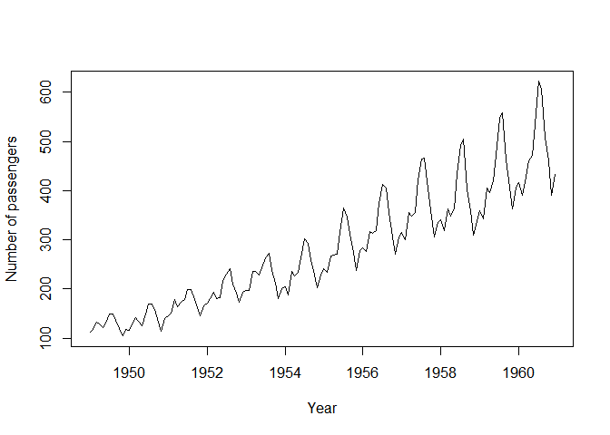
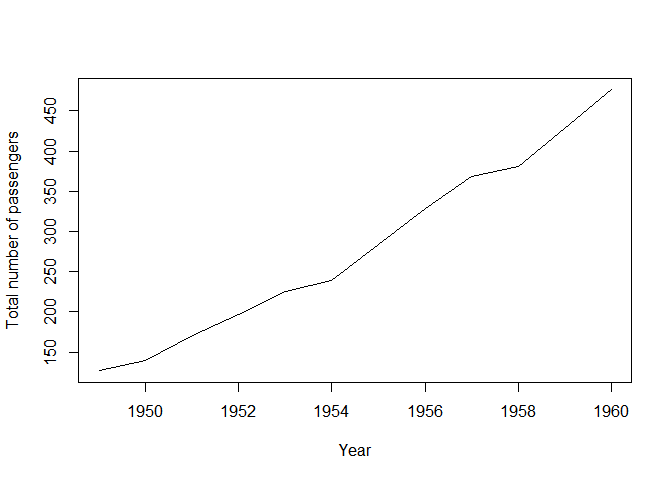

Exploring Air Passengers Dataset
================
Siddharth Jain

Air Passengers Dataset Analysis
===============================

### Visualizing and analysing the air passengers data

``` r
data("AirPassengers")
df <- AirPassengers
print(summary(df))
```

    ##    Min. 1st Qu.  Median    Mean 3rd Qu.    Max. 
    ##   104.0   180.0   265.5   280.3   360.5   622.0

``` r
start(df)
```

    ## [1] 1949    1

``` r
plot(df)
```



``` r
plot(aggregate(df,FUN=mean))
```



``` r
boxplot(df~cycle(df))
```


