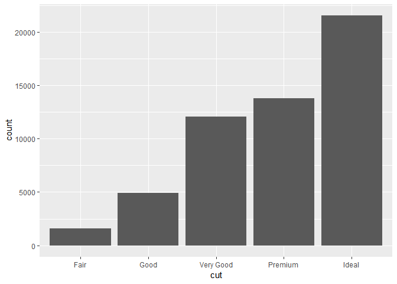
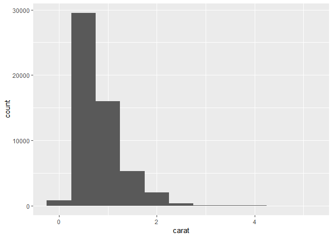
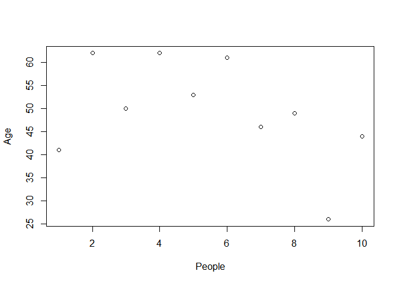

R and Data Science Introduction
================
Siddharth Jain
13 February 2019

Introduction
------------

**Data Science = Statistics/Maths + Coding + Domain/Business Knowledge**

Art of uncovering insights and trends behind data

Data
----

3 main categories

-   Structured (Databases)
-   Semi Structured (XML/ JSON/ Web pages)
-   Unstructured (Audio/ Video/ Image/ Natural Language)

Structured data = 20% of all data

Big Data
--------

Data whose scale, diversity, distribution and/or timeliness requires advanced technical architectures and analytics to enable insights.

Example: NY Stock Exchange

-   Huge volume
-   Complexity of datatypes and structures
-   Speed of new data creation
-   High growth

Drivers of Big Data:

-   Opportunity to enable innovative new business models
-   Potential for new insights
-   Exponential data growth
-   New formats of data
-   New sources of data (live clicks, streaming data, social networks)
-   Traditional solutions aren't working as well as they should
-   Cost of data systems is increasing
-   Open source data

**3Vs: Volume, Variety, Velocity**

**Importance** of Big Data:

-   Cost reduction
-   Time reduction
-   Smart decision making
-   Optimized offerings

Data Engineering
----------------

Data engineers help Data scientists do their jobs more effectively.

Gather, collect, store, batch process, and serve data to data scientists.

-   Wrangling: Manipulating raw data to make it useful for analytics/ for a ML model
-   Cleaning: Missing values, insufficient parameters
-   Preparation: Normalization, transforming input features, etc.

R Programming
-------------

Some important Data Structures in R:

1.  Vector (similar types of data)
2.  Matrix (2 dimensional)
3.  List (data of mixed types)
4.  Array (vector with one or more dimensions)
5.  Data Frames (each component of same length)
6.  Factors (Used to store categorical data)

#### R Data Types

-   Logical (TRUE, FALSE)
-   Numeric (12.3, 5, 1)
-   Integer (2L, 34L, 0L)
-   Complex (3+2i)
-   Character ('a', "Hello")
-   Raw (Use charToRaw to convert to ASCII values)

Everything in R is an object, and objects have attributes (identifiers).

-   Name
-   Dimension names (`dimnames`)
-   Class
-   Length

#### Vectors

Use the `c` keyword to concatenate items into a vector.

`<-` is the assignment operator in R. (`=` can also be used in most cases)

``` r
a <- c(1.8, 4.5, 3.3, 0.3)
print(typeof(a))
```

    ## [1] "double"

Creating a random vector with 5 elements, printing its sum

``` r
x <- rnorm(5)
print(x)
```

    ## [1] -2.08644684  0.90464732 -0.10038301  0.07266515 -0.02743576

``` r
print(sum(x))
```

    ## [1] -1.236953

Other built in arithmetic functions

-   sum() for total sum of vector
-   var() for variation
-   mean() for mean of the vector
-   min() and max() to find minimum and maximum elements

Sequences in R

``` r
x <- seq(1, 5)
print(x)
```

    ## [1] 1 2 3 4 5

`by` attribute can be passed to seq function to create steps

``` r
y <- seq(-1, 0, by=0.1)
print(y)
```

    ##  [1] -1.0 -0.9 -0.8 -0.7 -0.6 -0.5 -0.4 -0.3 -0.2 -0.1  0.0

#### Matrices

Creating a 3x3 matrix in R

``` r
vector1 <- c(2,9,3)
vector2 <- c(10,16,17,13,11,15)

colnames = c("Col1", "Col2", "Col3")
rownames = c("Row1", "Row2", "Row3")
result <- array(c(vector1,vector2),dim = c(3,3), dimnames = list(colnames,rownames))

print(result)
```

    ##      Row1 Row2 Row3
    ## Col1    2   10   13
    ## Col2    9   16   11
    ## Col3    3   17   15

Creating an empty 2x3 matrix

``` r
m = matrix(0.0, nrow=2, ncol=3) # 2x3
print(m)
```

    ##      [,1] [,2] [,3]
    ## [1,]    0    0    0
    ## [2,]    0    0    0

Checking the class of the object

``` r
print(class(m))
```

    ## [1] "matrix"

Checking type of values

``` r
print(typeof(m))
```

    ## [1] "double"

Checking length

``` r
print(length(m))
```

    ## [1] 6

#### Lists

Collections of mixed type data objects

The objects in a list are known as its components

Example

``` r
lst <- list(name = "Sid", height = "6", num_children = 3, child_ages = c(6, 7, 9))
print(lst[[1]])
```

    ## [1] "Sid"

``` r
print(lst$height)
```

    ## [1] "6"

To print 1st component of child\_ages

``` r
print(lst[[4]][1])
```

    ## [1] 6

#### Data Frames

Similar to matrix, may contain categorical as well as numerical data.

It is like a list with components as columns of a table.

``` r
measrmts <- data.frame(gender = c("F", "M", "M"), ht = c(180, 155, 165), wt = c(60, 80, 75))
print(measrmts)
```

    ##   gender  ht wt
    ## 1      F 180 60
    ## 2      M 155 80
    ## 3      M 165 75

``` r
print(measrmts[1, 2])
```

    ## [1] 180

Character vectors in data frame are stored as factor

``` r
class(measrmts$gender)
```

    ## [1] "factor"

Importing data
--------------

Use the `read.csv()` function to read 'comma separated value' (.csv) files.

This function also reads the headers (column names). To read without column names, use `read.table()`

`head` function is used to display first 5 rows, similarly `tail` for last 5.

``` r
my_data = read.csv("test.csv")
print(head(my_data))
```

    ##   age first_name gender
    ## 1  41       Evan   Male
    ## 2  62       Bill   Male
    ## 3  50      Craig   Male
    ## 4  62      Polly Female
    ## 5  53    Gabriel Female
    ## 6  61      Bruce Female

Dimension of the data using `dim` keyword. Rows then columns.

``` r
print(dim(my_data))
```

    ## [1] 10  3

Use `read.delim()` to read a .txt file

`write.csv()` and `write.delim()` can be used to write a file.

``` r
write.csv(measrmts, file="measurements.csv")
```

Statistics
----------

2 subdivisions of statistical methods:

1.  Descriptive
    -   Deals with presentation of numerical data in tables/ graphs.
    -   Methodology of analysing the data.
2.  Inferential
    -   Making inferences about the whole data based on observations from samples.

#### Descriptive Statistics

2 general types of statistics used to describe data: + Measures of central tendency (mean, median, mode) + Measure of spread (range, quartiles, absolute and standard deviation, variance)

Mean: Average of the data Median: Middle score for data arranged in order of magnitude Mode: Most frequent value in data Variance: *Mean of squares* of *deviations from mean* of the data Standard Deviation: *Square root* of variance

Useful keywords for descriptive analysis of data:

-   `summary()` : summarize all aatributes of a dataset.
-   `dim()` : display dimensions of the dataset.
-   `sapply()` : apply a function to each attribute of a dataset.
    -   `sapply(df, sd)` to find standard deviation for all attributes
-   `cor()` : to calculate correlation matrix (read about Pearson's correlation coefficient)
-   `mean()`
-   `median()`
-   `range()` : returns minimum and maxiumum
-   `var()` : variance
-   `sd()` : standard deviation

Exploratory Data Analysis
-------------------------

We can use a ton of plots to visualize our data.

R has many datasets inbuilt, or installed with ggplot2 (`install.packages("ggplot2")`).

Let us use the Diamond dataset.

Importing `ggplot2` library for datasets and plotting functions.

``` r
library('ggplot2')
```

Storing the `diamonds` dataset into `df` dataframe variable

``` r
df <- diamonds
print(dim(df))
```

    ## [1] 53940    10

``` r
print(head(df))
```

    ## # A tibble: 6 x 10
    ##   carat cut       color clarity depth table price     x     y     z
    ##   <dbl> <ord>     <ord> <ord>   <dbl> <dbl> <int> <dbl> <dbl> <dbl>
    ## 1 0.23  Ideal     E     SI2      61.5    55   326  3.95  3.98  2.43
    ## 2 0.21  Premium   E     SI1      59.8    61   326  3.89  3.84  2.31
    ## 3 0.23  Good      E     VS1      56.9    65   327  4.05  4.07  2.31
    ## 4 0.290 Premium   I     VS2      62.4    58   334  4.2   4.23  2.63
    ## 5 0.31  Good      J     SI2      63.3    58   335  4.34  4.35  2.75
    ## 6 0.24  Very Good J     VVS2     62.8    57   336  3.94  3.96  2.48

Bar plot

``` r
ggplot(data = df) + geom_bar(mapping = (aes(x = cut)))
```

 Histogram

``` r
ggplot(data = diamonds) + geom_histogram(mapping = aes(x = carat), binwidth = 0.5)
```



#### Visualizing a single variable

Many functions such as:

-   `plot(data)`: Scatterplot where x is index, y is value
-   `barplot(data)`: Bar plot
-   `dotchart(data)`: Cleveland dot plot
-   `hist(data)`: Histogram
-   `plot(density(data))`: Density ploy (continuous histogram)
-   `rug(data)`: Add a 1D rug representation to existing plot

Arugments `xlab` and `ylab` can be passed to a plot to add a label

``` r
plot(my_data$age, ylab = "Age", xlab = "People")
```


