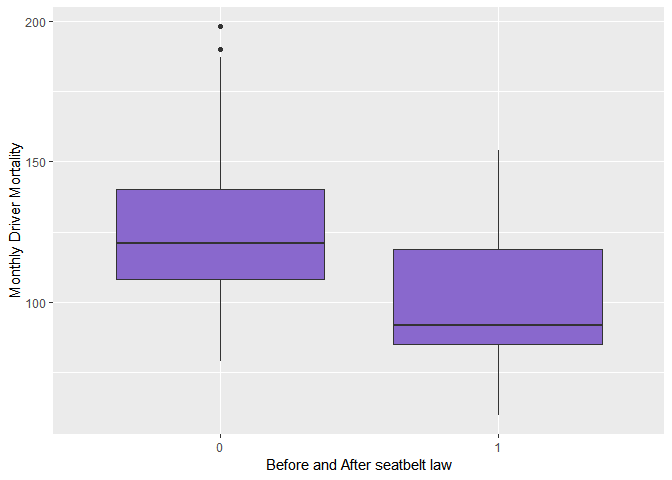

Seatbelts
================
Siddharth Jain
5 February 2019

Seatbelts Dataset
-----------------

``` r
data("Seatbelts")
Seatbelts <- data.frame(Year=floor(time(Seatbelts)),Month = factor(cycle(Seatbelts)), Seatbelts)
```

#### 10 Variables:

``` r
str(Seatbelts)
```

    ## 'data.frame':    192 obs. of  10 variables:
    ##  $ Year         : Time-Series  from 1969 to 1985: 1969 1969 1969 1969 1969 ...
    ##  $ Month        : Factor w/ 12 levels "1","2","3","4",..: 1 2 3 4 5 6 7 8 9 10 ...
    ##  $ DriversKilled: num  107 97 102 87 119 106 110 106 107 134 ...
    ##  $ drivers      : num  1687 1508 1507 1385 1632 ...
    ##  $ front        : num  867 825 806 814 991 ...
    ##  $ rear         : num  269 265 319 407 454 427 522 536 405 437 ...
    ##  $ kms          : num  9059 7685 9963 10955 11823 ...
    ##  $ PetrolPrice  : num  0.103 0.102 0.102 0.101 0.101 ...
    ##  $ VanKilled    : num  12 6 12 8 10 13 11 6 10 16 ...
    ##  $ law          : num  0 0 0 0 0 0 0 0 0 0 ...

#### Splitting data into before and after introduction of seatbelt legislation:

#### We do so based on the 'law' variable (0 for before, 1 for after)

``` r
BeforeLaw <- Seatbelts[Seatbelts$law ==0,]
AfterLaw <- Seatbelts[Seatbelts$law ==1,]

summary(BeforeLaw)
```

    ##       Year          Month    DriversKilled      drivers    
    ##  Min.   :1969   1      :15   Min.   : 79.0   Min.   :1309  
    ##  1st Qu.:1972   2      :14   1st Qu.:108.0   1st Qu.:1511  
    ##  Median :1976   3      :14   Median :121.0   Median :1653  
    ##  Mean   :1976   4      :14   Mean   :125.9   Mean   :1718  
    ##  3rd Qu.:1979   5      :14   3rd Qu.:140.0   3rd Qu.:1926  
    ##  Max.   :1983   6      :14   Max.   :198.0   Max.   :2654  
    ##                 (Other):84                                 
    ##      front             rear            kms         PetrolPrice     
    ##  Min.   : 567.0   Min.   :224.0   Min.   : 7685   Min.   :0.08118  
    ##  1st Qu.: 767.0   1st Qu.:344.0   1st Qu.:12387   1st Qu.:0.09078  
    ##  Median : 860.0   Median :401.0   Median :14455   Median :0.10273  
    ##  Mean   : 873.5   Mean   :400.3   Mean   :14463   Mean   :0.10187  
    ##  3rd Qu.: 986.0   3rd Qu.:454.0   3rd Qu.:16585   3rd Qu.:0.11132  
    ##  Max.   :1299.0   Max.   :646.0   Max.   :21040   Max.   :0.13303  
    ##                                                                    
    ##    VanKilled           law   
    ##  Min.   : 2.000   Min.   :0  
    ##  1st Qu.: 7.000   1st Qu.:0  
    ##  Median :10.000   Median :0  
    ##  Mean   : 9.586   Mean   :0  
    ##  3rd Qu.:13.000   3rd Qu.:0  
    ##  Max.   :17.000   Max.   :0  
    ## 

``` r
summary(AfterLaw)
```

    ##       Year          Month    DriversKilled      drivers    
    ##  Min.   :1983   2      : 2   Min.   : 60.0   Min.   :1057  
    ##  1st Qu.:1983   3      : 2   1st Qu.: 85.0   1st Qu.:1171  
    ##  Median :1984   4      : 2   Median : 92.0   Median :1282  
    ##  Mean   :1984   5      : 2   Mean   :100.3   Mean   :1322  
    ##  3rd Qu.:1984   6      : 2   3rd Qu.:119.0   3rd Qu.:1464  
    ##  Max.   :1984   7      : 2   Max.   :154.0   Max.   :1763  
    ##                 (Other):11                                 
    ##      front            rear            kms         PetrolPrice    
    ##  Min.   :426.0   Min.   :296.0   Min.   :15511   Min.   :0.1131  
    ##  1st Qu.:516.0   1st Qu.:347.0   1st Qu.:17971   1st Qu.:0.1148  
    ##  Median :585.0   Median :408.0   Median :19162   Median :0.1161  
    ##  Mean   :571.0   Mean   :407.7   Mean   :18890   Mean   :0.1165  
    ##  3rd Qu.:629.5   3rd Qu.:471.5   3rd Qu.:19952   3rd Qu.:0.1180  
    ##  Max.   :721.0   Max.   :521.0   Max.   :21626   Max.   :0.1201  
    ##                                                                  
    ##    VanKilled          law   
    ##  Min.   :2.000   Min.   :1  
    ##  1st Qu.:3.500   1st Qu.:1  
    ##  Median :5.000   Median :1  
    ##  Mean   :5.174   Mean   :1  
    ##  3rd Qu.:7.000   3rd Qu.:1  
    ##  Max.   :8.000   Max.   :1  
    ## 

``` r
library(ggplot2)
ggplot(Seatbelts, aes(x=factor(law), y=DriversKilled)) + geom_boxplot(fill="mediumpurple3") + theme_grey() +ylab("Monthly Driver Mortality") + xlab("Before and After seatbelt law")
```


