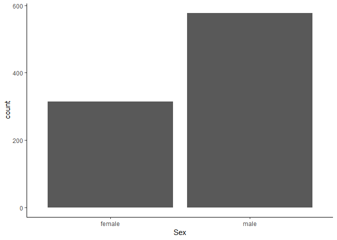

R Analysis of Titanic Dataset
================
Siddharth Jain
02 March 2019

Introduction
------------

We are analysing the various factors determining survival rates on the Titanic disaster. To do this, we will use various different features available about the passengers and visualize them.

### Importing the data

``` r
library("naniar")
```

    ## Warning: package 'naniar' was built under R version 3.5.3

``` r
library("ggplot2"); theme_set(theme_minimal())
library("dplyr")
```

    ## 
    ## Attaching package: 'dplyr'

    ## The following objects are masked from 'package:stats':
    ## 
    ##     filter, lag

    ## The following objects are masked from 'package:base':
    ## 
    ##     intersect, setdiff, setequal, union

``` r
library("tidyr")
```

    ## Warning: package 'tidyr' was built under R version 3.5.3

``` r
test = read.csv('test.csv', stringsAsFactors = FALSE)
train = read.csv('train.csv', stringsAsFactors = FALSE)
full <- bind_rows(train,test)
LT=dim(train)[1]
head(LT)
```

    ## [1] 891

``` r
str(full)
```

    ## 'data.frame':    1309 obs. of  12 variables:
    ##  $ PassengerId: int  1 2 3 4 5 6 7 8 9 10 ...
    ##  $ Survived   : int  0 1 1 1 0 0 0 0 1 1 ...
    ##  $ Pclass     : int  3 1 3 1 3 3 1 3 3 2 ...
    ##  $ Name       : chr  "Braund, Mr. Owen Harris" "Cumings, Mrs. John Bradley (Florence Briggs Thayer)" "Heikkinen, Miss. Laina" "Futrelle, Mrs. Jacques Heath (Lily May Peel)" ...
    ##  $ Sex        : chr  "male" "female" "female" "female" ...
    ##  $ Age        : num  22 38 26 35 35 NA 54 2 27 14 ...
    ##  $ SibSp      : int  1 1 0 1 0 0 0 3 0 1 ...
    ##  $ Parch      : int  0 0 0 0 0 0 0 1 2 0 ...
    ##  $ Ticket     : chr  "A/5 21171" "PC 17599" "STON/O2. 3101282" "113803" ...
    ##  $ Fare       : num  7.25 71.28 7.92 53.1 8.05 ...
    ##  $ Cabin      : chr  "" "C85" "" "C123" ...
    ##  $ Embarked   : chr  "S" "C" "S" "S" ...

### Visualizing missing data in the dataset

``` r
vis_miss(train)
```

    ## Warning: The `printer` argument is deprecated as of rlang 0.3.0.
    ## This warning is displayed once per session.



``` r
missing_values <- full %>% summarize_all(funs(sum(is.na(.))/n()))
missing_values <- gather(missing_values, key="feature", value="MissingPercentage")

missing_values %>% 

  ggplot(aes(x=reorder(feature,-MissingPercentage),y=MissingPercentage)) +

  geom_bar(stat="identity",fill="red")+

  coord_flip()+theme_bw()
```


Age has many missing values.

### Taking care of missing Age values

Replacing the missing values with the mean age of all the passengers on the Titanic

``` r
full <- full %>%

    mutate(

      Age = ifelse(is.na(Age), mean(full$Age, na.rm=TRUE), Age),

      `Age Group` = case_when(Age < 13 ~ "Age.00.12", 

                                 Age >= 13 & Age < 18 ~ "Age.13.17",

                                 Age >= 18 & Age < 60 ~ "Age.18.59",

                                 Age >= 60 ~ "Age.60.Ov"))
```

### Relationship between sex and survival, and subsequently between age and survival

``` r
ggplot(data=full[1:LT,],aes(x=Sex,fill=Survived))+geom_bar()
```


``` r
# First we'll look at the relationship between age & survival
ggplot(full[1:891,], aes(Age, fill = factor(Survived))) + 
  geom_histogram() + 
  # Including gender since we know it's important
  facet_grid(.~Sex) + 
  theme_minimal()
```

    ## `stat_bin()` using `bins = 30`. Pick better value with `binwidth`.


### Survival rate based on family size

``` r
full$Fsize <- full$SibSp + full$Parch + 1
full$Family <- paste(full$Surname, full$Fsize, sep='_')
# Use ggplot2 to visualize the relationship between family size & survival
ggplot(full[1:891,], aes(x = Fsize, fill = factor(Survived))) +
  geom_bar(stat='count', position='dodge') +
  scale_x_continuous(breaks=c(1:11)) +
  labs(x = 'Family Size') +
  theme_minimal()
```


We can see that single people and families with size&gt;4 had lower survival rates.

### Making a random forest model

``` r
##library('randomForest')
##rf_model <- randomForest(factor(Survived) ~ Pclass + Sex + Age + SibSp + Parch + 
                                 ##           Fare + Embarked,
                              ##              data = train, na.action = na.roughfix)

# Show model error
##plot(rf_model, ylim=c(0,0.36))
##legend('topright', colnames(rf_model$err.rate), col=1:3, fill=1:3)
```
