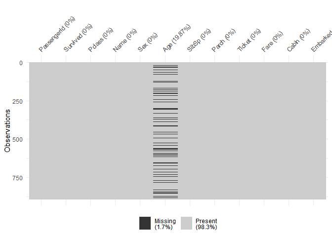

R Analysis of Titanic Dataset
================
Siddharth Jain
02 March 2019

Introduction
------------

We are analysing the various factors determining survival rates on the Titanic disaster. To do this, we will use various different features available about the passengers and visualize them.

### Importing the data

``` r
test = read.csv('test.csv', stringsAsFactors = FALSE)
train = read.csv('train.csv', stringsAsFactors = FALSE)
head(test)
```

    ##   PassengerId Pclass                                         Name    Sex
    ## 1         892      3                             Kelly, Mr. James   male
    ## 2         893      3             Wilkes, Mrs. James (Ellen Needs) female
    ## 3         894      2                    Myles, Mr. Thomas Francis   male
    ## 4         895      3                             Wirz, Mr. Albert   male
    ## 5         896      3 Hirvonen, Mrs. Alexander (Helga E Lindqvist) female
    ## 6         897      3                   Svensson, Mr. Johan Cervin   male
    ##    Age SibSp Parch  Ticket    Fare Cabin Embarked
    ## 1 34.5     0     0  330911  7.8292              Q
    ## 2 47.0     1     0  363272  7.0000              S
    ## 3 62.0     0     0  240276  9.6875              Q
    ## 4 27.0     0     0  315154  8.6625              S
    ## 5 22.0     1     1 3101298 12.2875              S
    ## 6 14.0     0     0    7538  9.2250              S

### Visualizing missing data in the dataset

``` r
library("naniar")
```

    ## Warning: package 'naniar' was built under R version 3.5.3

``` r
vis_miss(train)
```

 Age has many missing values.

``` r
library(ggplot2)
ggplot(data=train[1:dim(train)[1],],aes(x=Sex,fill=Survived))+geom_bar()+ theme_classic()
```


