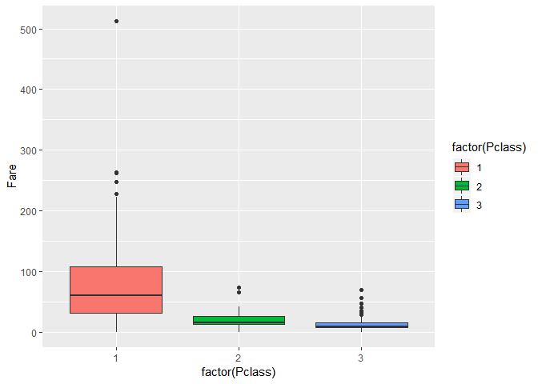

R Analysis of Titanic Dataset
================
Adwitiya Singh
9/10/2019

0. Introduction
---------------

[Titanic: Machine Learning from Disaster](https://www.kaggle.com/c/titanic) is a Kaggle beginner-friendly challenge, with the goal to predict who has survived or who was more likely to survive based on the background information such as age, sex, cabin class, ticket. Since many wonderful tutorials (both on Python and R) are available for this challenge, it is highly recommended for beginners to work on it and this is how I come here. It is a binary classification problem (survived or not). The CSV training and test datasets can be downloaded from the above website.

1. Libraries
------------

``` r
library("naniar")
library("ggplot2"); theme_set(theme_minimal())
library("dplyr")
library("tidyr")
```

2. Check the data
-----------------

Load the CSV datasets and combine them into one dataset for preprocessing, excluding the predictend `Suvived`.

``` r
trainData <- read.csv('train.csv')
testData <- read.csv('test.csv')
allData <- rbind(trainData[,-2],testData)
```

Check the feature space and missing values

``` r
str(allData)
```

    ## 'data.frame':    1309 obs. of  11 variables:
    ##  $ PassengerId: int  1 2 3 4 5 6 7 8 9 10 ...
    ##  $ Pclass     : int  3 1 3 1 3 3 1 3 3 2 ...
    ##  $ Name       : Factor w/ 1307 levels "Abbing, Mr. Anthony",..: 109 191 358 277 16 559 520 629 417 581 ...
    ##  $ Sex        : Factor w/ 2 levels "female","male": 2 1 1 1 2 2 2 2 1 1 ...
    ##  $ Age        : num  22 38 26 35 35 NA 54 2 27 14 ...
    ##  $ SibSp      : int  1 1 0 1 0 0 0 3 0 1 ...
    ##  $ Parch      : int  0 0 0 0 0 0 0 1 2 0 ...
    ##  $ Ticket     : Factor w/ 929 levels "110152","110413",..: 524 597 670 50 473 276 86 396 345 133 ...
    ##  $ Fare       : num  7.25 71.28 7.92 53.1 8.05 ...
    ##  $ Cabin      : Factor w/ 187 levels "","A10","A14",..: 1 83 1 57 1 1 131 1 1 1 ...
    ##  $ Embarked   : Factor w/ 4 levels "","C","Q","S": 4 2 4 4 4 3 4 4 4 2 ...

``` r
nrow(allData[!complete.cases(allData),])
```

    ## [1] 264

### Visualizing missing data in the dataset

``` r
vis_miss(allData)
```

    ## Warning: The `printer` argument is deprecated as of rlang 0.3.0.
    ## This warning is displayed once per session.



2. Handling missing values
--------------------------

Missing values can usually be delt with three ways: listwise deletion, multiple imputation and rational approaches. Since the missing values here are in the test dataset and the corresponding features are by intuition quite relevant to the prediction, a rational approach is employed to fill the missings. For `Fare`, the single missing value is replaced with the median of the Fare in the associated `Pclass`, which are actually highly correlated.

``` r
# boxplot
ggplot(data = allData,aes(x=factor(Pclass),y=Fare,fill=factor(Pclass))) + geom_boxplot(notch = FALSE)
```

    ## Warning: Removed 1 rows containing non-finite values (stat_boxplot).


``` r
# replace missing
allData[is.na(allData$Fare),]$Fare <-  median(allData[allData$Pclass==3,]$Fare,na.rm = TRUE)
```

The missing value is often replaced by the median age in the corresponding `Title` class. `Title` is a derived feature from the `Name` variable. Since `Title` and `Age` has some sort of correlation, it is hence reasonable to infer the age in this fasion, which may be even more appropriate.

Let's first creat the `Title` feature.

``` r
allData$Title <- sub('.*, (\\w+)\\. .*','\\1',allData$Name)
allData[!(allData$Title %in% c('Miss','Mr','Mrs','Master')),]$Title <- 'Respected'
table(allData$Sex,allData$Title)
```

    ##         
    ##          Master Miss  Mr Mrs Respected
    ##   female      0  260   0 197         9
    ##   male       61    0 757   0        25

Replace the missing ages with the median in the corresponding `Title`. Note that using median instead of mean is to reduce the influence of outliers.

``` r
for (ttl in levels(factor(allData$Title))){
  allData[(is.na(allData$Age)) & (allData$Title == ttl),]$Age <- 
    median(allData[allData$Title==ttl,]$Age,na.rm = TRUE)
}
```

Now, let us check that all missing values are gone.

``` r
sum(is.na(allData))
```

    ## [1] 0

### Relationship between sex and survival, and subsequently between age and survival

``` r
LT=dim(trainData)[1]

ggplot(data=trainData[1:LT,],aes(x=Sex,fill=Survived))+geom_bar()
```


``` r
# First we'll look at the relationship between age & survival
ggplot(trainData[1:891,], aes(Age, fill = factor(Survived))) + 
  geom_histogram() + 
  # Including gender since we know it's important
  facet_grid(.~Sex) + 
  theme_minimal()
```

    ## `stat_bin()` using `bins = 30`. Pick better value with `binwidth`.

    ## Warning: Removed 177 rows containing non-finite values (stat_bin).


